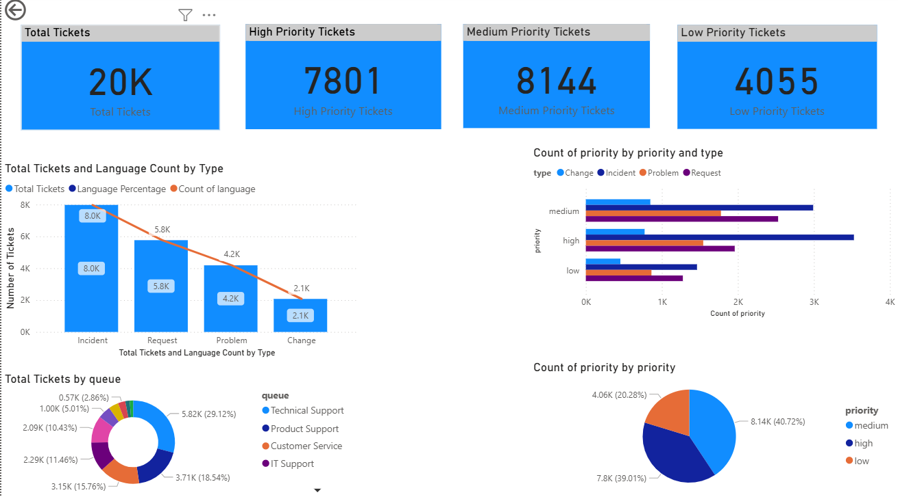

# Tickets-analysis-powerbi-R

Project combining R analysis and Power BI visualizations for ticket data.

## Περιεχόμενα φακέλων

- [PowerBI_Project.pbix](./PowerBI_Project.pbix) : Το αρχείο του Power BI dashboard.
- [dataset-tickets-multi-lang-4-20k.csv](./dataset-tickets-multi-lang-4-20k.csv) : Το αρχικό dataset με τα tickets.
- [rpubs analysis](https://rpubs.com/StefanosMan/1332157) : Αναλυτική ανάλυση και preprocessing στο R.

- ## Screenshot από το Power BI Dashboard
- 

## Περιγραφή

Αυτό το project συνδυάζει ανάλυση δεδομένων και text mining σε R με τη δημιουργία διαδραστικών dashboards στο Power BI.  
Στόχος είναι να αναλυθούν τα tickets υποστήριξης με βάση προτεραιότητα, τύπο, γλώσσα και άλλα χαρακτηριστικά, και να παρουσιαστούν εύκολα τα insights.

## Βιβλιοθήκες R που χρησιμοποιήθηκαν

Για την ανάλυση και την επεξεργασία δεδομένων χρησιμοποιούνται οι παρακάτω βιβλιοθήκες:

- **dplyr**: Για μετασχηματισμούς και χειρισμό δεδομένων.
- **stringr**: Για επεξεργασία και χειρισμό συμβολοσειρών.
- **wordcloud**: Για δημιουργία word clouds.
- **RColorBrewer**: Για παλέτες χρωμάτων στα γραφήματα.
- **knitr**: Για παραγωγή αναφορών.
- **ggplot2**: Για δημιουργία γραφημάτων.

